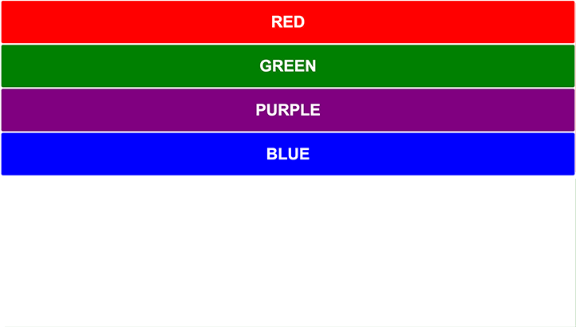
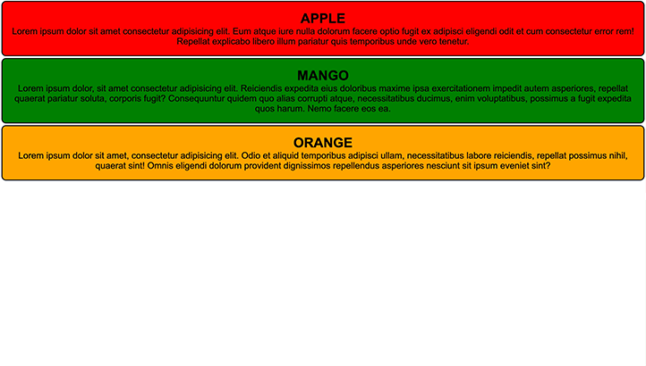
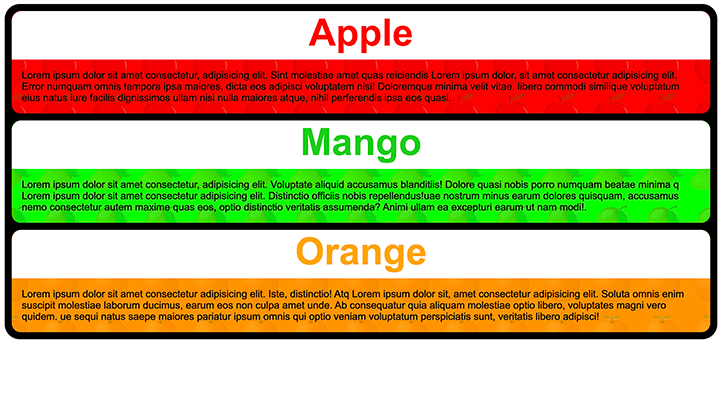
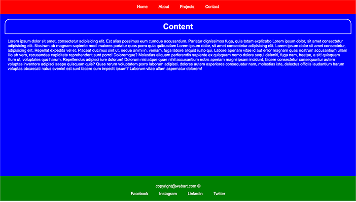
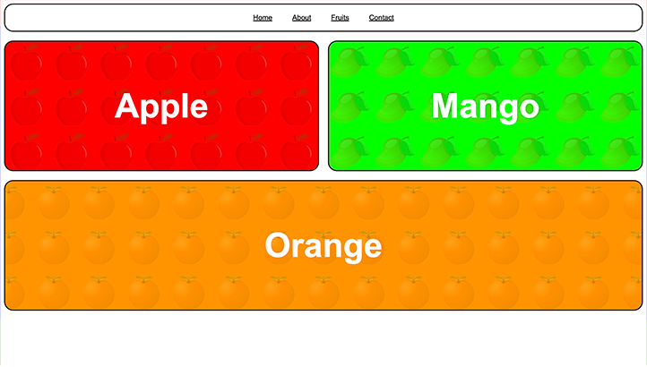
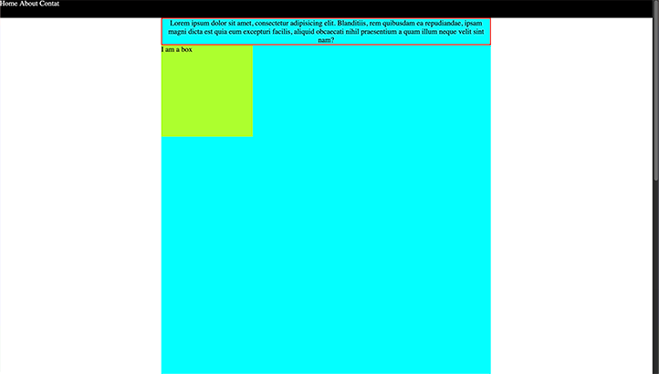
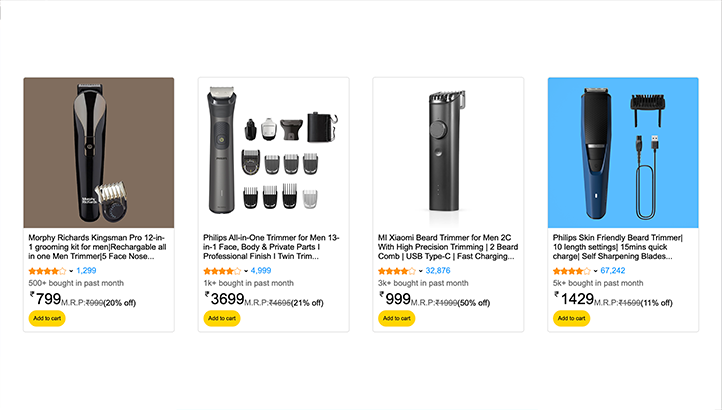

## Basic HTML CSS

#### *Contains your first 7 days of code when you first started to learn HTML & CSS*
---

`Journey 1`    

`Journey 2`  

`Journey 3`  

`Journey 4`  

`Journey 5`  

`Journey 6`  

`Journey 7`  

`Journey 8`  

`Journey 9`  

`Journey A`  

`Journey B`  

`Journey C`  

`Journey D`  

`Journey E`  

`Journey F`  

`Journey G`  

*Thanks for checking out😇*
